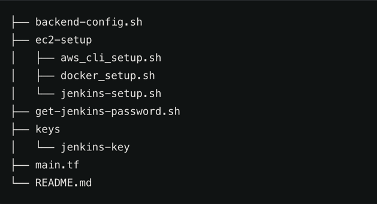

# Jenkins Deployment on AWS with Terraform
This project automates the deployment of a Jenkins server on AWS EC2 using Terraform and bash scripts. The setup is designed for automating the creation of a Jenkins instance, which is configured to build, test, and deploy Docker images to Docker Hub as part of a CI/CD process.

## Requirements

Before starting, make sure you have:

- **AWS Account**: Create and configure AWS IAM credentials.
- **Terraform**: Ensure Terraform is installed on your local machine or Jenkins instance.
- **AWS CLI**: Install AWS CLI to manage AWS services from the command line.
- **SSH Key**: You need an SSH key pair to access the EC2 instance.
- **Jenkins Setup Script**: Bash scripts (`jenkins-setup.sh`, `docker-setup.sh`, etc.) for configuring Jenkins on the EC2 instance.

---

## Configuration Notes

You will need to update a few configuration details before deployment:

- **`aws_cli_setup.sh`**:  
  Update the S3 bucket name and replace placeholder AWS Access Key and Secret Key with your credentials.

- **`jenkins-key.pem`**:  
  Create your own SSH key pair or use the provided one to access the EC2 instance.

- **`backend.tf` and `backend-config.sh`**:  
  Modify the bucket name to match your actual S3 backend bucket.

---

## Project Structure



The project includes the following files:

1. **main.tf** - Contains the Terraform configuration for creating AWS resources such as security groups and EC2 instances.
2. **backend-config.sh** - Automates the creation of an S3 bucket for storing Terraform state files and configuring the Terraform backend.
3. **get-jenkins-password.sh** - Retrieves the Jenkins admin password from the EC2 instance after it has been deployed.

---

## main.tf

This is the main Terraform configuration file used to create the required AWS resources. It defines the security group for Jenkins and provisions an EC2 instance where Jenkins will be installed.

### AWS Security Group (`aws_security_group`)

The security group allows access to the following ports:

- **22 (SSH)**: For accessing the EC2 instance via SSH.
- **8080 (Jenkins UI)**: For accessing the Jenkins web interface.
- **2375 (Docker Remote API)**: For Docker operations on the EC2 instance.
- **80 (HTTP)**: For HTTP traffic.
- **8000**: Custom port for your application.

### EC2 Instance (`aws_instance`)

The EC2 instance is launched with the following settings:

- **AMI**: `ami-04a5bacc58328233d` (Ubuntu 20.04 LTS)
- **Instance Type**: `t2.medium` (suitable for small Jenkins installations)
- **User Data**: Three setup scripts are executed on the EC2 instance to install Jenkins, AWS CLI, and Docker.

## 🚀 How to Launch the Project
### Important Step: Make .sh Scripts Executable
To ensure your .sh scripts can be executed, you need to use the chmod command to add the executable permission (+x). This step is important before running the scripts on any Linux-based system.

1. **Run backend setup & provisioning**  
   This script creates the S3 backend, initializes Terraform, and launches the EC2 instance:
   ```bash
   sudo ./backend-config.sh
   ```
2. **Wait a few minutes**
The EC2 instance will automatically install Jenkins, Docker, and AWS CLI via startup scripts.

3. **Get Jenkins admin password**
The EC2 instance will automatically install Jenkins, Docker, and AWS CLI via startup scripts.
```bash
   sudo ./get-jenkins-password.sh
   ```

4. **Access Jenkins in your browser**
Go to:
```cpp
   http://<EC2_PUBLIC_IP>:8080
   ```

4. **Start building**
Jenkins is ready for your CI/CD pipelines!

